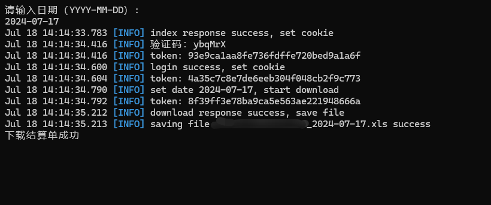

# cfmmc_spider

### 自动识别验证码登录[期货保证金监控中心](https://investorservice.cfmmc.com/)下载结算单

## 功能特点
- 支持自动识别验证码
- 支持全自动一键登录下载
- 支持自行选择逐日盯市或逐笔对冲

## 程序预览

## 下载使用
> 使用前需自行申请百度文字识别（OCR）服务，详见[API文档](https://cloud.baidu.com/doc/OCR/s/Ek3h7xypm)

> 使用前需填写config文件中的API Key、Secret Key及保证金监控中心的用户名和密码

> go build构建后即可使用

## 技术栈及依赖
- colly
- logrus

## 开发中
- 批量下载结算单
- 图形化界面操作
- 其他功能...